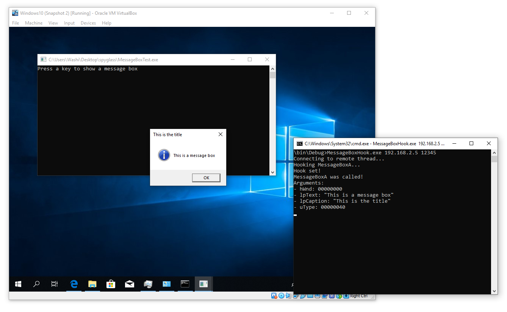
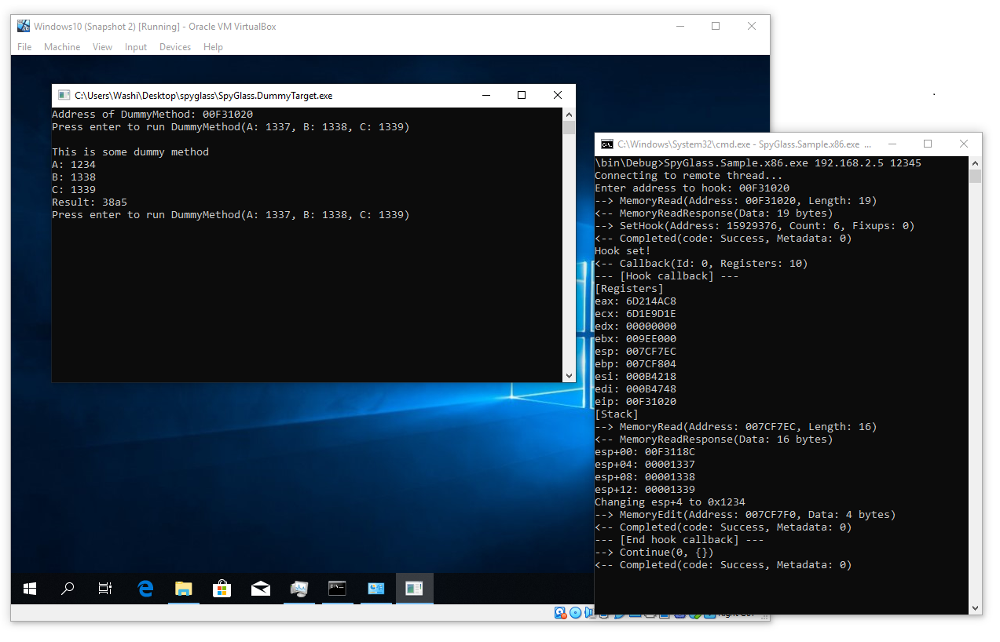

SpyGlass
========

SpyGlass is a hooking library that allows for hooking inside remote processes. The API is an event driven framework, allowing .NET developers easily inspect and alter the behaviour of the target process without having to write lots of code.

Features
========
- Hook anywhere in any process, even if the process is running on a different (virtual) machine.
    - Useful if the target application is malware and needs to be isolated from anything else.
- View and edit register values in the callback.
- View and edit memory in the callback.
- Various convenience methods, such as:
    - Getting the address of a procedure in a remote process.

Showcase
========

Inspecting the arguments of a MessageBoxA call
----------------------------------------------



The image above showcases a simple hooking application (on the right) that monitors a remote process running inside a virtual machine (on the left) that calls `MessageBoxA` at some point. We can use SpyGlass to hook this function remotely, and inspect the arguments. 

- Check out the [source code](src/Examples/MessageBox).
- To reproduce, run the following command in the VM:
    ```
    SpyGlass.Bootstrapper.x86.exe SpyGlass.Injection.x86.dll MessageBoxTest.exe
    ```
    And on the master machine, run:
    ```
    MessageBoxHook.exe <ip-address> 12345
    ```

Changing stack values on the fly
--------------------------------



In this case, the function `DummyMethod` in the slave process takes three arguments, and simply adds them together. This function is originally called with three arguments: `0x1337`, `0x1338` and `0x1339`. However, the master process hooked this function, and modified the first parameter from `0x1337` to `0x1234` in the callback.

- Check out the [source code](src/Examples/DummyExample).
- To reproduce, run the following command in the VM:
    ```
    SpyGlass.Bootstrapper.x86.exe SpyGlass.Injection.x86.dll SpyGlass.DummyTarget.exe
    ```
    And on the master machine, run:
    ```
    SpyGlass.Sample.x86.exe <ip-address> 12345
    ```

FAQ
===

How do I write my own hooks?
----------------------------
To write your own master process and/or bootstrapper, see the [quick starters guide](doc/QuickStart.md).

How does it work?
-----------------
Here's a quick summary of how the library works internally:

**How does the remoting part work?**
1. Target (slave) process is injected with a dynamically loaded library (dll). 
2. Library spawns a new thread.
3. Thread opens a TCP connection with the master process and starts listening for commands.

**How does the hooking process work?**
1. At the target address, we disassemble the instructions up to the point we have read at least 5 bytes of assembly code.
2. Construct a trampoline that ...
    - ... makes sure all registers (including the stack and program counters) are put in a safe spot.
    - ... calls the callback in a **__stdcall** fashion.
    - ... executes the disassembled instructions in step 1.
    - ... jumps back to the instruction after the place of the hook.
3. Insert a `call` to the trampoline at the position of the hook.
4. Report to the master process on events.

For details go [here](doc/HowItWorks.md).

Oh no I broke the library! What do I do now?
-------------------------------------------
First thing you have to remember is that I don't write bugs, only interesting new features. Make sure you are not just misusing a feature. With great power comes great responsibility!

If you still believe you have found a bug, please go to the [issue tracker](https://github.com/Washi1337/SpyGlass/issues/).


